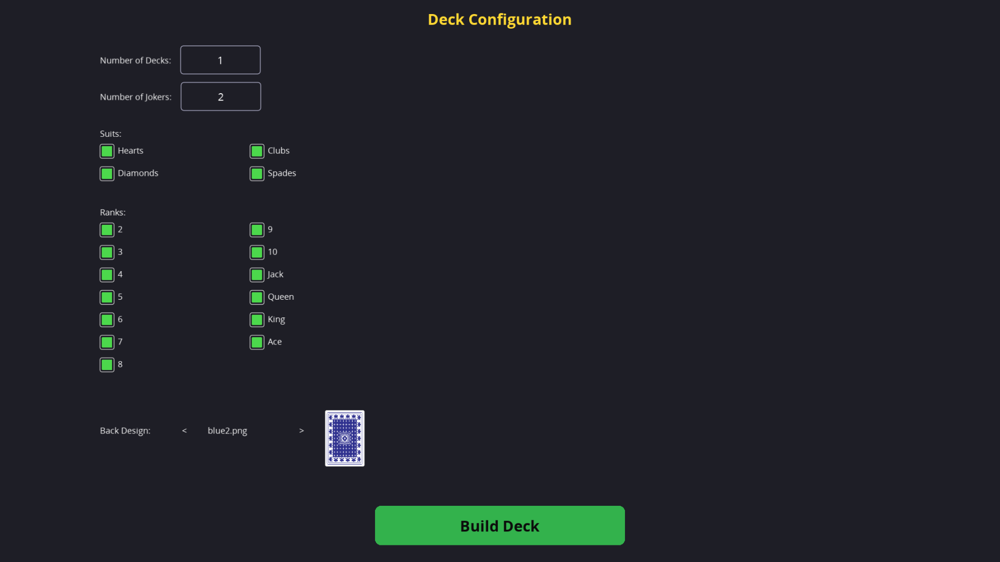
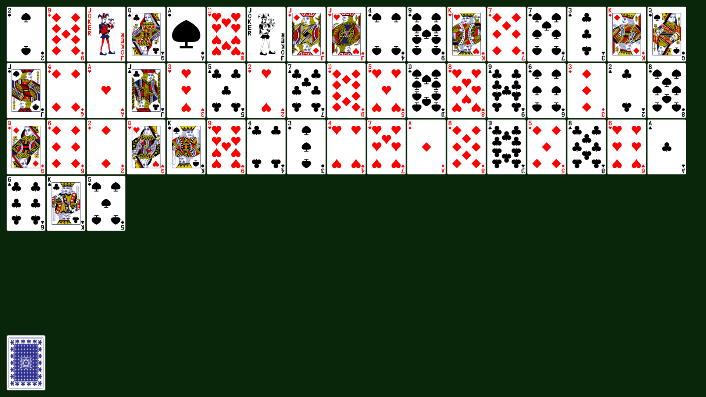

# The LÖVE2D Card Games Engine

This is a game engine written in Lua (LÖVE2D) for designing and playing card games over the internet using the standard 52-card French deck, or its derivatives. Card games can be saved, loaded and shared as JSON files. Think of it as Gary's mod -- but for playing cards.

## Screenshots

## Credits

* The game engine is written in the [LÖVE2D framework for Lua](https://www.love2d.org/).
* The card designs are taken from [Tek Eye](https://tekeye.uk/playing_cards/svg-playing-cards).
* The fonts are sourced from [edX Fonts](https://github.com/clintonb/edx-fonts).
